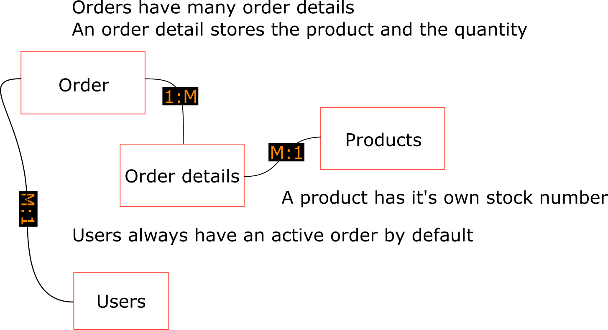

<!-- #  -->

# 

## The idea - GetSet

- It is a(n) ebay/amazon/aliexpress like webshop
- Huge variety of products (eg. music, hardware parts, clothes etc., basically anything)

## Features

- A multi page application with some AJAX
- Basic authentication/authorization system
- Customers can
  - add/update/remove products in their cart
  - checkout the cart
  - see previous orders
- Admins can
  - add/update/remove products to the site
  - see users
  
## Application logic

- basic exceptions handled (everything relies on the sql database)
